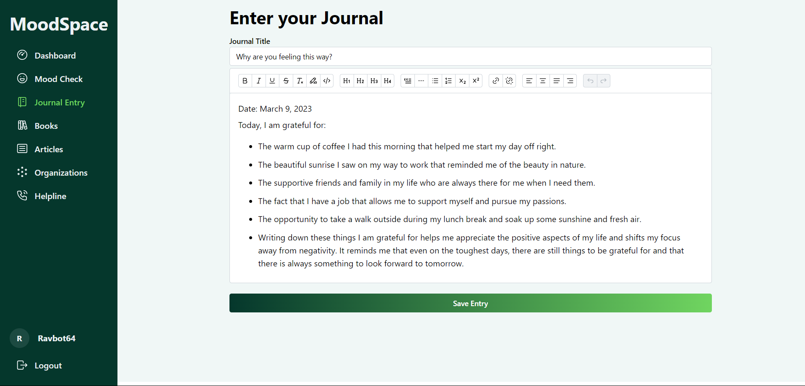

# MoodSpace

MoodSpace is a web application to help users track their moods, journal, and access mental health resources.

## Features

 - Mood Tracker: 
 - Journalling Editor:
 - Mental Health Resources

## Technologies

 - React
 - Vite
 - Mantine.js
 - Node.js
 - JSON

## Getting Started

### Prerequisites

 - Node.js (version 14 or newer)
 - npm

### Installation

 1. Clone this repository: `git clone https://github.com/Adarshkumar03/moodspace.git`
 2. Navigate to moodspace: `cd moodspace`
 3. Install Dependencies: `npm install`

### Development Mode

 1. Start the Vite develpment server: `npm run dev`

### Production Build

 1. Create an optimized build: `npm run build`
 2.  The  `dist`  folder produced by the build process contains static files. Deploy these to your preferred web hosting platform.

## Screenshots

### Home Page
 
### Login Page

### Register Page

### Dashboard Page

### Mood Tracker

### Journalling Editor

